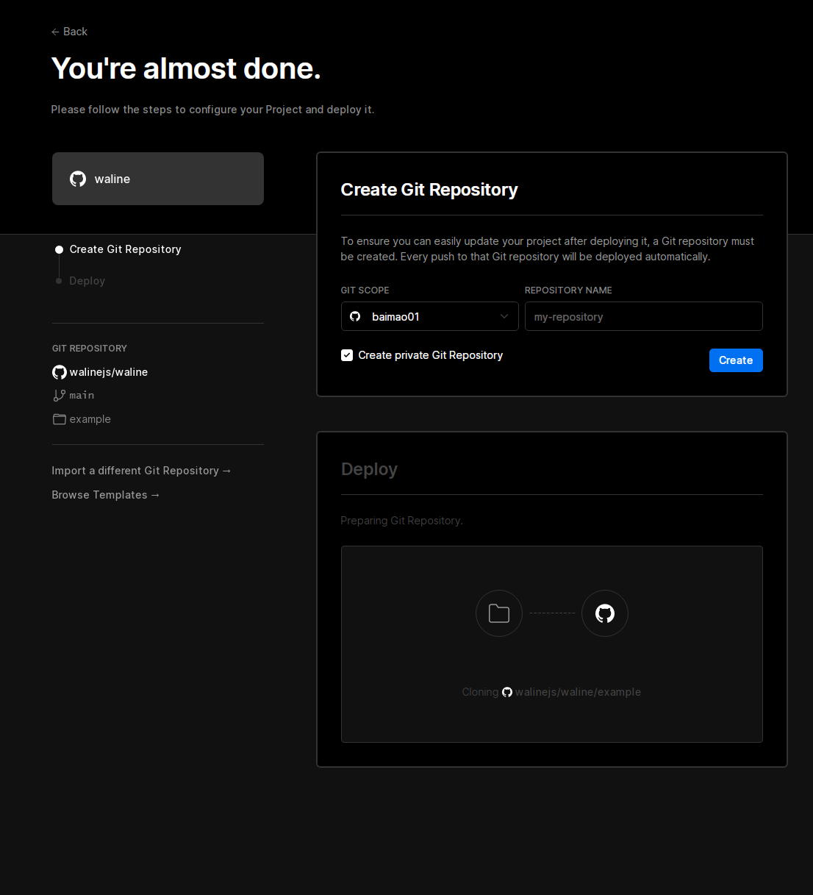

## 前言
具体教程最好还是看waline官方的教程[waline快速入门](https://waline.js.org/guide/get-started.html#vercel-%E9%83%A8%E7%BD%B2-%E6%9C%8D%E5%8A%A1%E7%AB%AF)
## 安装waline
### Vercel 部署
安装waline首先就需要注册一个vercel（别问我能不能用github来部署，答案是不行。github只能用来注册），打开[Deploy](https://vercel.com/import/project?template=https://github.com/walinejs/waline/tree/main/example)后点击带有github图标的按钮，登录你的github帐号，之后会要你输入手机号和验证码。注册完毕最好还是再点击一次刚刚的Deploy按钮避免一些问题，注册完毕后打开此链接应该长这样，在`Create Git Repository > REPOSITORY NAME`里随便填写一个你喜欢的名字我填写的是`blog-api`填写完毕后点击`Create`按钮静静等待即可途中不要关闭此网页。一两分钟后，满屏的烟花会庆祝你部署成功。此时点击`Go to Dashboard`可以跳转到应用的控制台，点击顶部的`Settings`在网页中找到`Environment Variables`进入环境变量配置页，并配置环境变量。
### 环境变量配置（数据库）
#### LeanCloud
在waline快速入手内找到教程，作者用的不是LeanCloud所以请观看waline的教程

---

这里提供两个作者用过的数据库，至于使用哪个看个人喜好吧，作者不想填手机号（LeanCloud）所以选择以下两个。
#### Deta Base
>注意事项：正在使用，此数据库是国外的虽然访问速度不佳但是总比github好一点（至少能打开）。
##### 注册帐号
打开[Deta Base](https://docs.deta.sh/docs/base/about/)翻到最底下找到一个蓝色的Deta按钮并点击，如果你有网站翻译器的话最好翻译一下。在打开的页面中找到register按钮（如果没有的话你找一个翻译，把`注册`翻译成英文找一下有没有，当然你的浏览器如果有翻译插件就用翻译插件。注册完毕后会弹出一个页面并告诉你项目密钥和编号记得把它记下来（作者本人已注册找不到退出登录的按钮所以有点忘了，可以去网上找找教程）
#### GitHub
>注意事项：已弃用，原因github和Deta Base都是国外的，但是用github作为数据库还不如Deta Base，具体你自己试试就知道了即使你登录了发了一条消息刷新一下你的头像都会消失如果你是博主做测试你还会发现你本来应该有的`博主`标签没了，所以非常不推荐使用github。你硬要用我也没办法）。

用github作为数据库非常"简单"创建一个仓库（名称为waline，其实随便起一个名字都可以但是为了方便辨认所以取名为waline）将此仓库设置为公开的（public）在下方勾选`Add a README file`之后打开[github密钥](https://github.com/settings/tokens)在里面点击此按钮`Generate new token`在打开的页面里为这个密钥随便取一个名字，找到并勾选`repo`选项之后在最下方点击绿色按钮创建即可。详细教程见[waline](https://waline.js.org/guide/server/databases.html#cloudbase)在下方找到github按照那些变量填写即可
#### 环境变量填写
按照waline教程填写即可，如果使用其他数据库则按照[waline](https://waline.js.org/guide/server/databases.html#cloudbase)教程，在里面找到对应数据库名称填写即可。

---

剩下你看官方的教程吧我累了不写了QnQ