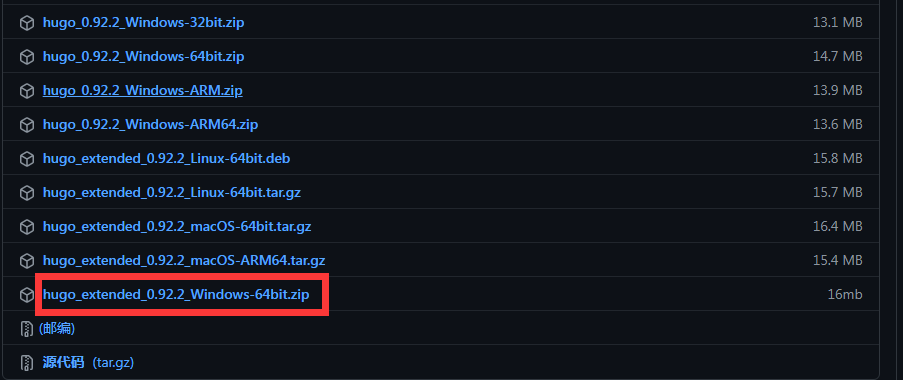

## 简介
今天准备更新博客的主题版本时发现使用3.0.0以上版本时会报错，之后在下载位置往下找到3.0.0时发现在3.0.0及以上版本时需要使用扩展版本的hugo。希望这期教程能帮助大家。
## 安装扩展版本的hugo
经过搜索以及下载地址作者发现3.0.0及以上需要hugo的扩展版本。
在hugo的下载地址里找到下载后按照[如何使用hugo搭建网站并部署到github](https://baimao01.github.io/2022/如何使用hugo搭建网站并部署到github/)的教程使用。
## 升级主题
在stack的仓库里找到最新版本并下载，下载后依旧是按照 如何使用hugo搭建网站并部署到github 这篇文章使用（之后需要将所有文章备份，否则会被覆盖），之后就升级成功啦～