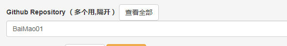

## 相关链接
[静态博客管理后台](https://jingtaiboke.com/)
## 前言

这个工具猫猫也是刚刚接触，还不是很熟悉。如有错误可以在评论区纠正qwq

这是一个能让你在网页上写博客的工具，虽然不是很熟悉，但是初步体验也是很好！
## 体验
先给大家体验以下在告诉大家要不要用吧cwc。
首先就是它的优缺点：

- 简单方便，在浏览器上使用，只要你能用Github就没问题了


- 需要能够访问Github

用起来还是很好的也是比较推荐。
## 使用
使用方法肥肠简单，你只需要按下首页的绿色按钮，登录github并授权即可，接下来应该会弹出一个页面这里的框框里就填你博客的仓库名称即可，不需要其他的东西，完成后你就添加了这个博客，接下来点击`进入后台`按钮。这样你就可以对博客编辑了。
### 新建文件夹
先把新建文件夹的方法放出来吧，新建文件就比较简单了。猫猫这里总结了2种方法。
> 第一种，这个方法是最简单也是最稳定的，先在`Github Desktop`把仓库下载到本地如果你是开着的话就在上方找到`Fetch origin`