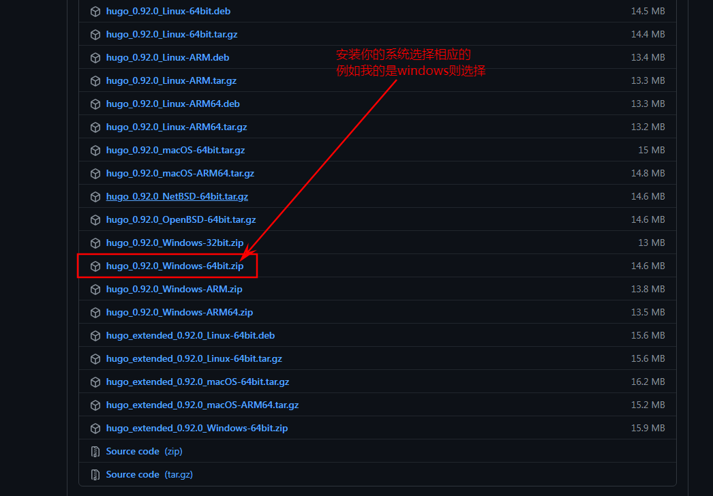
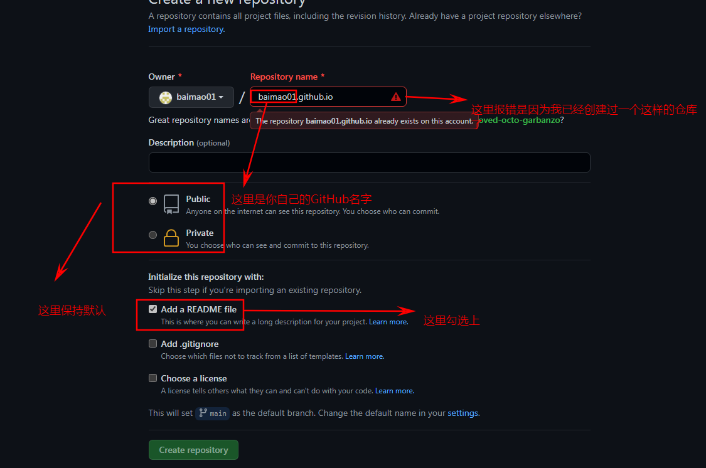
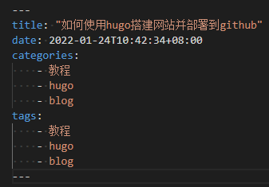

## 前言
### 概述
- 1.零成本，使用hugo搭建个人网站并部署在GitHub Page上。
- 2.本文不能让你对hugo有全面的认知，由此需求请自行搜索教程或阅读官方文档。
- 3.由于GitHub属于国外的在国内使用体验较差，建议使用国内的Gitee，两者均通用。
- 4.本文会在cmd，git等的命令用括号括起来方便阅读所以之需要输入括号内的字符不需要括号本身，例如[cd 你博客的名称]
### 相关链接
- [hugo中文官网](https://www.gohugo.org/) [hugo官网](https://gohugo.io/)
- [hugo中文官网皮肤列表](https://www.gohugo.org/theme/) [hugo官网皮肤列表](https://themes.gohugo.io/)
- [hugo下载](https://github.com/gohugoio/hugo/releases)
- [git下载](https://git-scm.com/download/win)
## 搭建博客
### 搭建博客之前的准备
#### 下载安装
我们打开相关链接中的hugo下载以及git下载，按照一下方法下载安装。
- hugo 选择你的系统进行下载，以我的为例  ，下载好了之后我们把它放的一个地方（你喜欢放哪就放哪）然后解压。安装好了之后我们还要配置一下系统环境。

- hugo 系统环境配置， 找到你的计算机图标，右键找到属性并点击，打开后会有一个界面我们找到 高级系统设置 并打开，打开后会出来一个界面我们点击下面的环境变量。在环境变量中找到Path并打开，如果你的path里已经有其他变量了则在最后一行输入;你的hugo存放位置(例如我的是;D:\boke\bin本人系统为windows7，windows10可能不同，win10直接点击添加输入hugo的路径即可)之后我们在键盘上同时按下 windows+R 之后在弹出的界面里输入cmd并回车或点击确定，然后会弹出一个窗口，我们在里面输入hugo version之后回车，如果显示  就代表安装成功了。

- git 下载，在相关链接内找到git下载，打开链接后我们安装你的选择64-bit Git for Windows (如果你的系统是32位就选择32-bit Git for Windows)。下载下来后我们打开Git的安装包然后按Next选择你要安装的位置，之后一直按Next即可。
#### GitHub Page
- 我们需要把我们的博客部署到GitHub Page所以我们需要GitHub帐号，这里不演示百度上一搜就有。然后新建一个仓库，这个仓库要使用一下格式命名及配置，  都完成后点击下方的绿色按钮就创建成功了(如果重复了名称那里会发红)。
#### Github SSH配置
- 先在C:\Users\你的名字\目录下右键在菜单内找到并点击Git Bash Here然后输入[ssh-keygen -t rea -C "你注册Github的邮箱地址"]之后一直按4次回车（在上一个回车按完并且弹出下一个时），之后会在你的C:\Users\你的名字\目录下生成一个.ssh文件夹我们打开它。然后你会看到2个文件，一个是没有后缀的和有后缀的（如果都没有显示后缀就在网上查找方法）我们用任意一个文本编辑器打开有后缀的那个文件，然后同时按下Ctrl+A选中全部文本，之后再Ctrl+C复制。然后打开Github页面，左键点击你的头像，在弹出的页面内选择Settings。之后在打开的页面内找到 SSH and GPG keys并点击，找到绿色的New SSH key按钮并点击，在打开的页面里找到Key下面的框框并点击把你刚刚复制的东西Ctrl+V粘贴到里面，之后在上面的Tile里随便写一些字（白猫写的是自己GitHub的名字）。之后找到下面的Add SSH key按钮并点击，然后我们的SSH密钥就配置完成了。
### 开始搭建博客
#### 在本地创建博客
- 按照之前的方法打开cmd并输入hugo new site 你的网站的名字 ，就在C:User/你的用户名字/ 下生成了一个文件夹，打开它。
#### 添加主题
- 首先我们就需要为我们的网站添加一个主题，首先在相关链接内打开hugo官网皮肤列表(中文也可以但是主题较少)，找到你喜欢的主题之后打开，在打开之后的网页里点击download，把主题下载下来后复制到次路径 C:User/你的用户名字/你的网站名字/themes 目录下之后把主题文件解压并安装当时下载主题时作者告诉你的名字把解压下来的文件命名为那个，之后把主题文件的压缩包删除。然后在解压出来并重新命名的文件夹打开找到以下目录exampleSite打开，把里面的config.toml和content文件夹复制出来到 你的网站名字里替换（如果那个文件夹里没有config.toml只有config.yaml就把config.yaml复制出去并且把config.toml名称改为config_backup.toml）。然后主题就安装完成。
#### 写文章
- 首先我们打开cmd输入[cd 你的博客名称]然后输入[hugo new post/这个文章的文件夹名称/index.md]之后hugo会自动在你写的目录下添加一个文章，然后用你的编辑器打开你的文章，你会发现一些字，所以我们先来认识一下这些字是什么意思。（可以先把自动添加的字删除，复制本文章的字进去），本文格式为，title: ""是你的文章名字（名字在""内写）date: xx 是你文章的创建时间，生成这个文章时会自动填写，categories: -xxx是你的文章类别，tags: -xxx是你的文章标签。
#### 将博客上传到互联网
- 首先打开config.yaml文件（后缀可能是toml），之后找到baseurl: 将后面的删除（只删除那一行后面的）把你的网站网址填写在后面。
- 然后在C:\Users\你的用户名字\你的博客名字 目录下右键打开git bash here（也可以使用cmd但是为了所有命令都能顺利执行所以使用git本身）输入[hugo]等执行完弹出下一个时再输入[cd public]依旧是等执行完之后再输入[git init] (建议输入2次)之后输入[git add -A] (只需要输入1次)之后再输入[git commit -am"init"]之后输入[git remote add origin_ssh git@github.com:你的仓库名字/你的仓库名字.github.io.git] （例如我的是[git remote add origin_ssh git@github.com:baimao01/baimao01.github.io.git]建议输入2次）最后再输入[git push -f origin_ssh master]即可上传，然后你的网站地址就是 你的仓库名字.github.io （打开后可能没有任何内容，过一会就有了）。
### 更新你的博客
- 首先在C:\Users\你的用户名字\你的博客名字 目录下右键打开git bash here 之后依次输入[hugo -D]，[cd public]，[git add .]，[git commit -am"init"]，[git push -f origin_ssh master]

