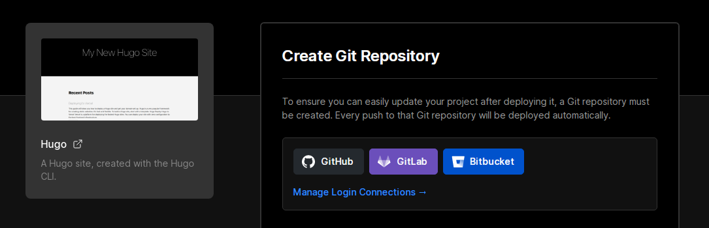
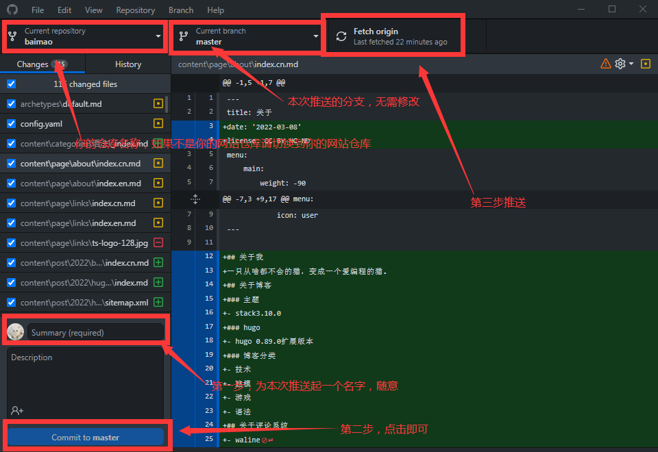

## 简介
### 概述
由于github访问速度不佳以及有时无法访问所以需要将博客部署在其他的地方，推荐使用vercel。vercel默认会给我们分配一个`.vercel.app`的二级域名。并且vercel还能做到自动部署『作者不是很懂这个，只知道要推送到github仓库上而已。』
### 相关链接
- [vercel](https://vercel.com/)
## vercel
### 创建hugo模板
注册完vercel后打开[vercel创建模版](https://vercel.com/new)之后在页面中找到并点击`Browse All Templates`在里面找到hugo之后你会看到选择github然后会让你输入这个项目的名称『名称随意，如：你的网站名称』，名称填写完毕后点击右下角的蓝色按钮。
#### 报错
在创建时你会发现下方的一个会有一个感叹号，这种情况是因为vercel的hugo版本太低了，所以我们要给他指定一个hugo版本。在页面上方点击`settings`按钮进入设置页面，在设置页面中打开`Environment Variables`在打开的页面中找到`NAME`填入`HUGO_VERSION` `VALUE`中填入`0.89.0`『当然你也可以使用新版本』完成后点击右下角的`Add`按钮再到`Deployments`页面中找到竖着的3个点并点击在弹出的窗口中点击`Redeploy`这样就会重新部署，“稍稍”等待一会后你的blog就部署成功了。
***
### Import已存在的hugo仓库
首先需要创建一个仓库，之后把你的blog推送上去『注意：此推送请把public文件夹删除，只推送博客文件夹』。
## 克隆到本地
首先找到你要克隆到的地方，之后打开你的`Github Desktop`在主页找到`File`在页面中找到`Clone repository`然后选择你的博客所在的仓库。之后这个仓库就会被克隆到本地了『你所指定的目录中』，克隆完毕后第一件事肯定是给博客装上主题了『你不装也可以，vercel会自动给你分配一个不知道在哪找的主题。』。找到你克隆到本地的文件夹，在文件夹中打开`themes`在里面会发现一个叫做『我忘了以后再看看吧，这个不是主题名字，你到时自己看吧我懒得再创建一个了。』这个等会是要删除的当然你也可以现在删除，安装`Stack`主题个人觉得`Stack`这样卡片式主题很好看，非常推荐使用此主题现在hugo使用此主题的人还算比较“多”。
## 安装主题
>会下载安装hugo主题的可以跳过了
***
### 简介

>此教程虽适用于`Stack`以及其它主题但，如果使用其他主题还是请仔细观看此主题作者的官方文档。
***
>此教程的演示主题为`Stack`
***
>其实这个教程跟[hugo ｜ 如何使用hugo搭建网站并部署到github](http://baimao.vercel.app/2022/hugo-%E5%A6%82%E4%BD%95%E4%BD%BF%E7%94%A8hugo%E6%90%AD%E5%BB%BA%E7%BD%91%E7%AB%99%E5%B9%B6%E9%83%A8%E7%BD%B2%E5%88%B0github/)差不多只是少了一些部署和命令行的操作

### 下载主题
方法1『下载』：
找到你要使用的主题，这里以[Stack](https://themes.gohugo.io/themes/hugo-theme-stack/)主题为例，在打开的页面中点击`Download`点击后会跳转到这个主题的Github页面，点击绿色的`Code`按钮选择`Download ZIP`之后就会下载这个主题了。
***
方法2『Fork及克隆』：
找到你要使用的主题，这里以[Stack](https://themes.gohugo.io/themes/hugo-theme-stack/)主题为例，在打开的页面中点击`Download`点击后会跳转到这个主题的Github页面，点击页面上方的`Fork`按钮之后这个仓库就会`Fork`到你的账户下了。之后打开`Github Desktop`将仓库克隆到本地。
### 安装
将下载的压缩包解压『直接解压会导致各种各样的问题，所以请先放的一个文件夹里再解压，或者把它解压到一个空的文件夹里』，解压后剪切或复制粘贴到`Themes`文件夹下。或将克隆到的文件夹剪切或复制粘贴到`Themes`文件夹下。
>注意：你的主题文件夹可以随意命名但请注意，config配置文件中要填写的是文件夹的名字，如果我的文件夹为`Stack`则需要在配置文件中填写`Stack`如果我的文件夹为`hugo-Stack`则填写`hugo-Stack`。
### 安装2
>此教程也是必须的。

在主题文件夹中找到`exampleSite`将里面的`content`文件夹`config.yaml`文件复制到博客文件夹中例如：`E:/hugo`中并将`config.toml`文件删除。
***
汉化『如果你想将你的博客改为中文就跟着教程做』：
在主题文件夹中找到i18n文件夹，在i18n文件夹中找到`zh-cn`改为`cn`『经过测试如果不改名会导致一些地方汉化失效，仅测试过1次，作者也不确定』。之后回到根目录，打开`config.yaml`文件按照此代码进行修改
```yaml
baseurl: https://baimao.vercel.app/ #你博客的网址
languageCode: cn #语言『请填 cn』
theme: stack #主题文件夹名称
paginate: 10 #主页文章显示数量
title: Bai Mao #网站名称及头像下的名称

languages:
    en:
        languageName: English
        title: Bai Mao #英文名称，仅在切换为英文时显示
        weight: 1 #位置『在语言选项中的排序位置』
    cn:
        languageName: 中文
        title: Bai Mao #中文名称，仅在切换为中文时显示
        weight: 2 #位置『在语言选项中的排序位置』

#主题文件夹名称
disqusShortname: stack

#无需修改
googleAnalytics:

# Theme i18n support
# Available values: en, fr, id, ja, ko, pt-br, zh-cn, zh-tw, es, de, nl, it, th, el, uk, ar
DefaultContentLanguage: cn #网站默认语言『请填 cn』

# Set hasCJKLanguage to true if DefaultContentLanguage is in [zh-cn ja ko]
# This will make .Summary and .WordCount behave correctly for CJK languages.
hasCJKLanguage: true #未知但还是按照填写

permalinks:
    post: /:year/:slug/ #网址例如此文章为 baimao.vercel.app/2022/vercel-将博客部署在vecrel上/
    page: /:slug/ #未知                                     ↑这篇文章的创建日期『年』

params:
    mainSections:
        - post
    featuredImageField: image
    rssFullContent: true
    favicon: /img/favicon.jpg #网站图标『』开头没有/则会导致只有主页显示图标

    footer:
        since: 2022 #网站创建日期
        customText:

    dateFormat:
        published: Jan 02, 2006
        lastUpdated: Jan 02, 2006 15:04 MST

    sidebar:
        emoji: #默认有个东西，删除即可
        subtitle: 你见过会用电脑的猫吗？ #你的简介
        avatar:
            enabled: true
            local: true #    ↓你的头像图片后缀
            src: img/avatar.jpg #头像，在主题文件夹中新建static并在里面再次新建img之后复制粘贴你的头像即可
#                     ↑你的头像图片名字
```

## 推送到github仓库上
打开你的`Github Desktop`按照此图片操作 