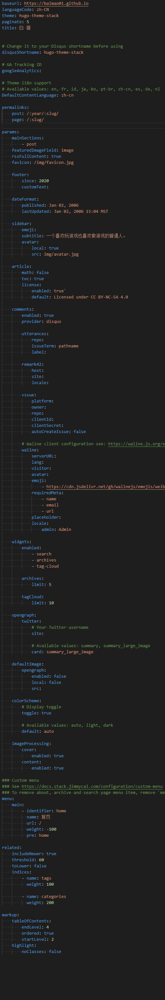
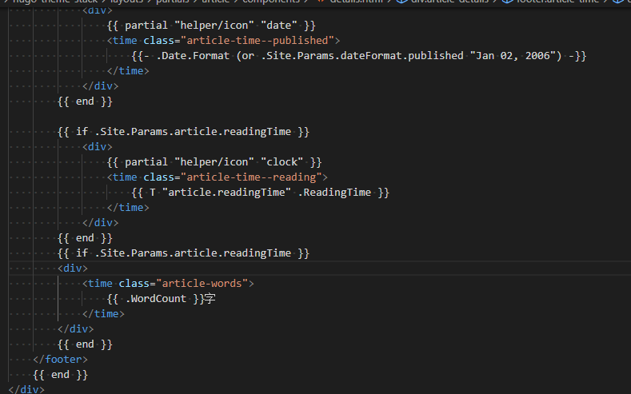

## 前言
大家看完[如何使用hugo搭建网站并部署到github](https://baimao01.github.io/2022/如何使用hugo搭建网站并部署到github/)可能就想修改自己网站的图标但是网上可能没有找到有用的教程，以及其它的样式。
- 编辑器工具: VS code
## 参考链接
- [hugo ｜ 看中Stack主题的归档功能，搬家并修改](https://mantyke.icu/2021/f9f0ec87/)
- [hugo ｜ 另一篇Stack主题装修记录](https://mantyke.icu/2021/a08f1963/)
- [hugo ｜ 第三篇Stack主题装修记录，堂堂再临！](https://mantyke.icu/2022/stack-theme-furnish03/)
- [hugo ｜ hugo-stack-theme 主题魔改版](https://mantyke.icu/2022/stack-theme-mod/#%E5%85%B6%E4%BB%96%E5%8F%82%E8%80%83)
## 修改
- 首先我们需要在C:\Users\你的系统用户名字\你的网站名字\themes\你的主题名字 目录下创建static文件夹然后打开在里面创建img文件夹，在里面放入你的网站图标并且命名为favicon。
- 之后打开C:\Users\你的系统用户名字\你的网站名字 目录下的config.yaml文件（后缀可能是toml），按照次图片以及下文修改即可（#是注释的意思，没有注释就按照此图片修改即可）
```yaml
baseurl: https://baimao01.github.io #你的网站地址
languageCode: zh-CN
theme: hugo-theme-stack #你的主题名字
paginate: 5 #首页文章数量
title: 白 猫 #你在网站中显示的名字


# Change it to your Disqus shortname before using
disqusShortname: hugo-theme-stack #你的主题名字

# GA Tracking ID
googleAnalytics:

# Theme i18n support
# Available values: en, fr, id, ja, ko, pt-br, zh-cn, es, de, nl #支持的语言
DefaultContentLanguage: zh-cn
```
```yaml
params:
    mainSections:
        - post
    featuredImageField: image
    rssFullContent: true
    favicon: /img/favicon.jpg #你的网站图标，按照上面的教程填写即可
```
```yaml
sidebar:
        emoji: 
        subtitle: 一个喜欢玩游戏也喜欢做游戏的普通人。 #你的简介
        avatar:
            local: true
            src: img/avatar.jpg #文件在 你的网站名字\themes\你的主题名字\assets\img目录下，默认可能没有也可能有，随便找一张你想当作头像的图片放进去并命名为avatar即可（jpg是文件后缀按照你的后缀填写即可）
```
## 修改所有相应分类
相信大家的文章多了就会发现文章的分类颜色都是不一样的，通过以下代码可以修改所有对应名称的分类。
>位置在 你的博客名称/content/categories目录下新建对应分类名称的文件夹，并在文件夹中创建一个_index.md文件。
```
---
title: "分类名称"
image: 
style:
    background: "#F0F8FF" //分类颜色
    color: "#000000" //字体颜色
---
```
>颜色都是十六进制的哦~
## 彩虹背景
>在`themes/hugo-theme-stack/layouts/partials/footer/custom.html` 下添加以下代码
```html
<script
    src="https://cdn.jsdelivr.net/gh/zhixuan2333/gh-blog@v0.1.0/js/ribbon.min.js"
    integrity="sha384-UEK8ZiP3VgFNP8KnKMKDmd4pAUAOJ59Y2Jo3ED2Z5qKQf6HLHovMxq7Beb9CLPUe"
    crossorigin="anonymous"
    size="300"
    alpha="0.6"
    zindex="-1"
    defer
></script>
```
## 加载进度条
>在`themes/hugo-theme-stack/layouts/partials/footer/custom.html` 下添加以下代码
```html
<script
    src="https://cdn.jsdelivr.net/gh/zhixuan2333/gh-blog@v0.1.0/js/nprogress.min.js"
    integrity="sha384-bHDlAEUFxsRI7JfULv3DTpL2IXbbgn4JHQJibgo5iiXSK6Iu8muwqHANhun74Cqg"
    crossorigin="anonymous"
></script>
<link
    rel="stylesheet"
    href="https://cdn.jsdelivr.net/gh/zhixuan2333/gh-blog@v0.1.0/css/nprogress.css"
    integrity="sha384-KJyhr2syt5+4M9Pz5dipCvTrtvOmLk/olWVdfhAp858UCa64Ia5GFpTN7+G4BWpE"
    crossorigin="anonymous"
/>
<script>
    NProgress.start();
    document.addEventListener("readystatechange", () => {
        if (document.readyState === "interactive") NProgress.inc(0.8);
        if (document.readyState === "complete") NProgress.done();
    });
</script>
```
## 文章字数统计
>在`themes/hugo-theme-stack/layouts/partials/article/components/details.html`
```html
        {{ if .Site.Params.article.readingTime }}
        <div>
            <time class="article-words">
                {{ .WordCount }}字
            </time>
        </div>
        {{ end }}
```

>还需要在config.yaml中修改以下代码
```yaml
hasCJKLanguage: false 
```
改为
```yaml
hasCJKLanguage: true
```
## 站点总字数统计
>在`themes/hugo-theme-stack/layouts/partials/footer/footer.html`
```html
<section class="copyright">
        &copy; 
        {{ if and (.Site.Params.footer.since) (ne .Site.Params.footer.since (int (now.Format "2006"))) }}
            {{ .Site.Params.footer.since }} - 
        {{ end }}
        {{ now.Format "2006" }} {{ .Site.Title }}
        <br/>
        共 {{ len (where .Site.RegularPages "Section" "post") }} 篇文章
        {{$scratch := newScratch}}
        {{ range (where .Site.Pages "Kind" "page" )}}
            {{$scratch.Add "total" .WordCount}}
        {{ end }}
        共写了{{ div ($scratch.Get "total") 1000.0 | lang.FormatNumber 2 }}k字.
    </section>
```
>修改即可不需要重新添加
## 头像与站点描述居中显示
>在`assets\scss\partials\sidebar.scss`中修改以下代码（找到相应的并修改即可）
```yaml
	.site-avatar {
        position: relative;
        margin-left:auto; //站点头像居中
		margin-right:auto; //站点头像居中
        width: var(--sidebar-avatar-size);
        height: var(--sidebar-avatar-size);

	.site-name {
        color: var(--accent-color);
        text-align:center; //站点名称居中
        font-size: 1.8rem;

        @include respond(2xl) {
            font-size: 2rem;
        }
    }

	.site-description {
        color: var(--body-text-color);
        font-weight: normal;
        text-align:center; //站点描述居中
        font-size: 1.6rem;

        @include respond(2xl) {
            font-size: 1.7rem;
        }
    }
```
