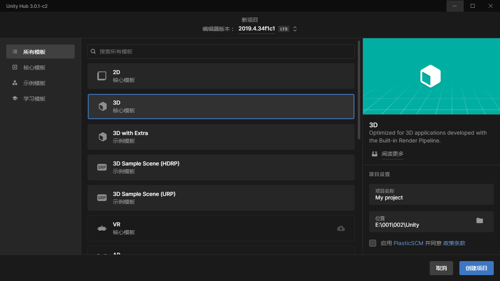

## 简介
- 本文所有内容都是作者自己的经验，不能让你对unity有完整的理解。
## 相关链接
- [unity官网](https://unity.com/) [unity中文官网](https://unity.cn/)
- [unity中文官网下载](https://unity.cn/releases)
- 由于官网在国外所以不推荐使用unity官网，推荐使用unity中文官网。
- 请先下载unity hub并在unity hub内下载unity版本
## 下载安装
下载好unity hub后打开并登录你的unity帐号，之后点击设置，在设置里找到许可证。点击添加，找到获取免费的个人版许可证，点击后会出现一个界面，直接点中间的同意即可。
## 添加一个项目
在unity hub的主界面找到新项目（旧版本叫做添加）并点击，在显示出来的界面中可以看到如果你做的是3D游戏就选择3D核心模版，如果是2D则选择2D核心模版，在项目设置那里可以设置这个项目的名字和存放路径
## 基础配置
### 设置中文
添加并打开一个项目后你会发现他的界面是英文的所以我们需要把它改成中文的。找到最上方的Edit在里面倒数第5个打开后在里面的倒数第2个找到之后在里面的第2个选项里调成简体中文，然后你的unity就变成中文了，但是你可能发现只有少部分变成了中文。所以需要重启编辑器，重启后就会发现编辑器里大部分都变成了中文。
## 

